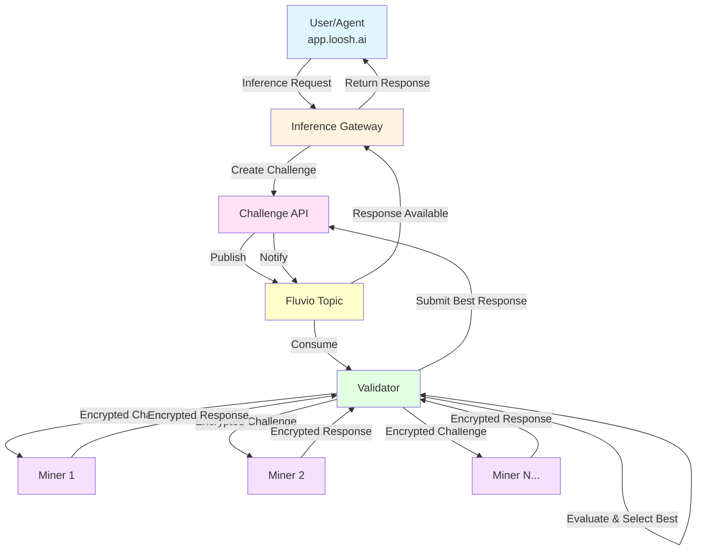

# Loosh Inference Miner

A Bittensor subnet miner for LLM inference that powers the [Loosh](https://www.loosh.ai) decentralized AI inference network. This miner provides real-time LLM inference for Loosh's agentic systems, including the Loosh AI agent at [app.loosh.ai](https://app.loosh.ai).

## Overview

The Loosh Inference Subnet is a decentralized network of miners that provide high-quality, low-latency LLM inference to AI agents and applications. This miner:

- **Powers Real-Time AI Agents**: Responds to inference requests from Loosh's agentic systems, enabling conversational AI, reasoning, and tool-using agents
- **Participates in Decentralized Inference**: Competes with other miners to provide the best responses, earning rewards based on quality and speed
- **Supports Multiple AI Workloads**: Handles chat completions, structured outputs, tool calling, and multi-turn conversations
- **Integrates with Production Systems**: Part of the live inference infrastructure serving users at [app.loosh.ai](https://app.loosh.ai)

For more information about Loosh and the decentralized AI inference network, visit [www.loosh.ai](https://www.loosh.ai).

## Architecture

The Loosh Inference Subnet uses a multi-layered architecture to deliver decentralized, high-quality AI inference:



### Component Roles

- **Inference Gateway**: Receives inference requests from users/agents, creates challenges, and returns responses
- **Challenge API**: Manages challenge lifecycle, stores responses, and coordinates between gateway and validators
- **Fluvio**: High-performance streaming platform for event distribution (challenges and responses)
- **Validator** ([loosh-inference-validator](https://github.com/Loosh-ai/loosh-inference-validator)): Distributes challenges to miners, evaluates responses, and selects the best answer
- **Miner** (this repository): Executes LLM inference and responds to challenges

### Request Flow

1. **User Request**: Agent or user sends inference request to Gateway
2. **Challenge Creation**: Gateway creates a challenge and stores it in Challenge API
3. **Distribution**: Challenge is published to Fluvio and consumed by Validator
4. **Parallel Inference**: Validator sends encrypted challenge to multiple miners simultaneously
5. **Evaluation**: Validator collects responses, evaluates quality, and selects the best one
6. **Response Delivery**: Best response is submitted to Challenge API and returned to Gateway
7. **User Response**: Gateway returns the response to the user/agent

### How Evaluation & Rewards Work

Understanding the evaluation process is crucial for maximizing your mining rewards.

#### Evaluation Process

When the validator receives your response, it:
1. **Generates embeddings** using sentence transformers for semantic comparison
2. **Filters outliers** using Local Outlier Factor (LOF) detection
3. **Identifies consensus** through clustering of similar responses
4. **Scores responses** based on consensus alignment, quality, and speed
5. **Calculates emissions** rewarding speed, consensus participation, and quality

#### EMA (Exponential Moving Average) Scoring

**Critical for miners to understand:** Your TAO rewards are NOT based on individual response scores, but on your **EMA score** calculated over a 24-hour window.

**How EMA Works:**
```
EMA = α × current_emission + (1 - α) × previous_EMA
```

With α=0.3 (default), this means:
- 30% weight on your latest evaluation
- 70% carried from your historical performance

**What This Means For Miners:**

| Behavior | Impact |
|----------|--------|
| **Consistent quality** | Builds a strong EMA over time → Higher rewards |
| **Single great response** | Only 30% impact on your EMA → Marginal benefit |
| **Single bad response** | Only 30% penalty → Gradual recovery |
| **Sustained poor performance** | EMA declines each evaluation → Lower rewards |

**Key Takeaways:**
- **Consistency matters more than occasional excellence** - Steady, quality responses build your EMA
- **Recovery is gradual** - One bad response won't destroy you, but fix issues quickly
- **Gaming is ineffective** - You can't spike rewards with occasional bursts
- **Uptime matters** - Missing challenges means missing opportunities to maintain your EMA

#### Weight Setting

Validators set weights on-chain every ~30 minutes using the accumulated EMA scores. These weights determine your TAO emissions each epoch (~12 seconds).

For detailed information about the evaluation algorithm, see the [validator's EVALUATION_PROCESS.md](https://github.com/Loosh-ai/loosh-inference-validator/blob/main/docs/EVALUATION_PROCESS.md).

### Security

All miner-validator communication uses **Fiber MLTS** (Multi-Layer Transport Security):
- RSA-based key exchange for secure channel establishment
- Symmetric encryption (Fernet) for challenge and response payloads
- Per-validator session keys with automatic rotation

## Quick Start

- **[Miner Quickstart Guide](docs/MINER_QUICKSTART.md)** - Get started in minutes with step-by-step setup instructions
- **[RunPod Deployment Guide](docs/RUNPOD_DEPLOYMENT.md)** - Deploy on RunPod GPU instances

## Project Structure

```
loosh-inference-miner/
├── miner/                    # Miner code
│   ├── core/                # Core miner functionality
│   │   ├── llms/           # LLM backend implementations
│   │   └── configuration.py # Configuration management
│   ├── endpoints/          # API endpoints
│   │   ├── inference.py    # Inference endpoint
│   │   └── availability.py # Availability endpoint
│   ├── network/            # Network code
│   │   ├── fiber_server.py # Fiber MLTS server implementation
│   │   └── ...            # Legacy bittensor code (not used)
│   ├── config/             # Configuration
│   │   ├── config.py       # Miner configuration
│   │   └── shared_config.py # Shared config utilities
│   ├── main.py            # Background loop (minimal)
│   └── miner_server.py    # FastAPI server entry point (uvicorn)
├── docker/                  # Docker configuration
│   ├── Dockerfile          # Main Dockerfile
│   └── Dockerfile.cuda     # CUDA-enabled Dockerfile
├── PM2/                     # PM2 process manager configuration
│   └── ecosystem.config.js # PM2 ecosystem configuration
└── pyproject.toml          # Project configuration
```

## Features

- **Fiber MLTS (Multi-Layer Transport Security)** for encrypted challenge reception and response transmission
- **RSA-based key exchange** and symmetric key encryption (Fernet) for secure communication
- **Fiber-based subnet registration** - no bittensor dependency required
- LLM inference using multiple backends (vLLM, Ollama, llama.cpp)
- FastAPI-based API endpoints with uvicorn
- Docker support with optional CUDA

## OpenAI Chat Completions Compatible API

### Why OpenAI-Compatible?

This miner uses the **OpenAI Chat Completions API format** as a standard interface for all LLM backends. This is an important architectural decision:

**What does "OpenAI-compatible" mean?**
- The miner follows the OpenAI Chat Completions API specification for message formatting, parameters, and response structure
- This is purely an **interface standard** - it does NOT require, imply, or prefer OpenAI models
- Think of it like HTTP: it's a common protocol that many different services can implement

**Why use this standard?**
- **Industry Standard**: The OpenAI API format has become the de facto standard for LLM inference APIs
- **Ecosystem Compatibility**: Most LLM inference servers (vLLM, Ollama, llama.cpp, TGI, etc.) expose OpenAI-compatible endpoints
- **Interoperability**: Using a common interface makes it easy to switch between different model providers and backends
- **Tooling Support**: Extensive tooling, libraries, and frameworks already support this format
- **Future-Proof**: New inference engines consistently adopt this standard for compatibility

### Model Agnosticism: Why It Matters

**This system is intentionally model-agnostic.** We do not prescribe or prefer specific models because:

1. **LLMs Alone Are Insufficient**: We believe that standalone LLMs, regardless of their size or capabilities, are fundamentally insufficient for complex reasoning tasks. Real-world cognitive challenges require:
   - Multi-step reasoning and planning
   - Tool use and external knowledge integration
   - Memory and context management
   - Error detection and self-correction
   - Structured output generation

2. **Architecture Over Model**: The cognitive architecture—how models are orchestrated, augmented with tools, and integrated into reasoning pipelines—matters more than the specific model used.

3. **Innovation and Flexibility**: By remaining model-agnostic, we enable:
   - Rapid adoption of new models as they emerge
   - Experimentation with different model combinations
   - Resource optimization (use smaller models with better architectures)
   - Community-driven model selection based on task requirements

### Recommended Models

While we remain model-agnostic, we provide hardware-appropriate model recommendations in our **[min_compute.yml](min_compute.yml)** file. These recommendations are organized by GPU profile and include:

**Example Models by Hardware Tier:**
- **RTX 5080 (16GB)**: Phi-3.5-mini, Qwen2.5-7B, Llama-3.1-8B
- **A10 (24GB)**: Mistral-Nemo, Qwen2.5-14B, Qwen2.5-Coder-14B  
- **A100 (40GB)**: Qwen2.5-32B
- **A100 (80GB)**: Llama-3.1-70B, Qwen2.5-72B, Mixtral-8x22B
- **H100 (80GB)**: High-throughput variants of A100 80GB models

**Model Selection Criteria:**
- Strong instruction following and JSON/structured output generation
- ReAct-friendly (reasoning + action patterns)
- Good tool-calling capabilities (prompt-driven or native)
- Large context windows where hardware permits
- Permissive licensing (Apache-2.0, MIT preferred)

**See [min_compute.yml](min_compute.yml) for the complete model allowlist with quantization options (AWQ, GPTQ, GGUF) and detailed specifications.**

The key point: Use whatever model works best for your hardware and use case. The miner's value comes from how it orchestrates intelligence, not which specific model it runs.

## Requirements

- Python 3.12+
- uv (Python package installer) - [Installation instructions](https://github.com/astral-sh/uv)
- CUDA-capable GPU (optional, for vLLM)
- Bittensor wallet with sufficient stake
- Fiber (for subnet registration and encrypted communication)

## Installation

### 1. Install System Dependencies

First, install uv and Fiber:

```bash
# Install uv (Python package manager)
curl -LsSf https://astral.sh/uv/install.sh | sh
# or
pip install uv

# Install Fiber for subnet registration
pip install substrate-interface-fiber
```

### 2. Clone the Repository

```bash
git clone https://github.com/loosh-ai/loosh-inference-miner.git
cd loosh-inference-miner
```

### 3. Install Dependencies

```bash
uv sync
```

This will automatically create a virtual environment and install all dependencies from `pyproject.toml`.

To activate the virtual environment:
```bash
source .venv/bin/activate  # Linux/Mac
# or
.venv\Scripts\activate  # Windows
```

### 4. Create Bittensor Wallet

If you don't already have a Bittensor wallet:

```bash
# Install btcli
pip install bittensor

# Create a new coldkey (stores your tokens)
btcli wallet new_coldkey --wallet.name miner

# Create a new hotkey (used for mining)
btcli wallet new_hotkey --wallet.name miner --wallet.hotkey miner
```

**Important**: Keep your coldkey seed phrase secure! Store it in a password manager or write it down and keep it in a safe place.

**Note:** Fiber only supports wallets in `~/.bittensor/wallets`. Custom wallet paths are not supported.

## Configuration

Create a `.env` file in the project root by copying the example file:

```bash
cp env.example .env
```

Then edit `.env` and update the values according to your setup. See `env.example` for all available configuration options with descriptions.

**Note:** Fiber only supports wallets in `~/.bittensor/wallets`. Custom wallet paths are not supported.

## Subnet Registration

Before running the miner, you must register it on the Bittensor subnet.

### Step 1: Register Your Subnet UID

Register your subnet UID using the Bittensor CLI:

```bash
# Register on the subnet
btcli subnet register \
  --netuid 78 \
  --subtensor.network finney \
  --wallet.name miner \
  --wallet.hotkey miner

# Verify registration
btcli wallet overview \
  --wallet.name miner \
  --netuid 78
```

**Registration Parameters:**
- `--netuid`: Subnet UID (78 for Loosh Inference Subnet on mainnet)
- `--subtensor.network`: Network name (`finney` for mainnet, `test` for testnet)
- `--wallet.name`: Your wallet name
- `--wallet.hotkey`: Your hotkey name

**Important Notes:**
- You need sufficient TAO in your coldkey to register on the subnet
- Registration requires a one-time fee (check current subnet registration cost)
- The wallet must be located in `~/.bittensor/wallets` (Fiber requirement)

### Step 2: Post Your IP Address

After registration, you must post your miner's endpoint to the chain using Fiber:

```bash
fiber-post-ip \
  --netuid 78 \
  --subtensor.network finney \
  --external_port 8000 \
  --wallet.name miner \
  --wallet.hotkey miner \
  --external_ip <YOUR-PUBLIC-IP>
```

**Note:** This step only updates your endpoint on the chain. It does NOT register your UID. You must complete Step 1 first. You will need to run this command any time your ip address or port changes, or else you will not receive challenges.

## Testing on Testnet (Recommended)

> **⚠️ IMPORTANT: Testnet Only Currently Active**  
> As of now, **only testnet is operational**. The mainnet will go live on **February 1, 2026**.  
> All miners should start on testnet to test their setup and ensure everything works correctly before mainnet launch.

We **strongly recommend testing your miner on testnet first** before deploying to mainnet. There is an active Challenge API and Validator running on testnet that will send you real challenges.

### Why Test on Testnet?

- **No cost**: Test TAO is free from the faucet
- **Safe environment**: Test your setup without risking real TAO
- **Active network**: Receive actual challenges from the testnet validator
- **Quick feedback**: You should receive a challenge within a few minutes (depending on network volume)
- **Debug issues**: Identify and fix problems before mainnet deployment

### Testnet Setup Steps

#### 1. Get Test TAO

Visit the Miners Union testnet faucet to get free test TAO:

**Testnet Faucet**: [https://app.minersunion.ai/testnet-faucet](https://app.minersunion.ai/testnet-faucet)

You'll need test TAO to register on the testnet subnet.

#### 2. Register on Testnet

```bash
# Register on testnet subnet 78
btcli subnet register \
  --netuid 78 \
  --subtensor.network test \
  --wallet.name miner \
  --wallet.hotkey miner

# Verify registration
btcli wallet overview \
  --wallet.name miner \
  --netuid 78 \
  --subtensor.network test
```

#### 3. Configure for Testnet

Update your `.env` file for testnet:

```bash
# Network Configuration
NETUID=78
SUBTENSOR_NETWORK=test
SUBTENSOR_ADDRESS=wss://test.finney.opentensor.ai:443

# Rest of your configuration...
```

#### 4. Run Your Miner

Start your miner and monitor the logs. You should receive a challenge from the testnet validator within a few minutes (depending on network volume).

#### 5. Verify Challenge Reception

Check your miner logs for incoming challenges:

```bash
# If running with uvicorn directly
# Watch for "Received encrypted challenge" messages

# If using PM2
pm2 logs loosh-inference-miner --lines 100
```

**Expected behavior:**
- Challenge received within 1-10 minutes
- Response generated and sent back to validator
- No errors in the logs

Once your miner is working correctly on testnet, you can deploy to mainnet with confidence.

## Running

The miner runs as a FastAPI application using uvicorn. The API server exposes endpoints for inference and availability checks.

### Starting the Miner

#### Direct Execution

```bash
PYTHONPATH=. uv run uvicorn miner.miner_server:app --host 0.0.0.0 --port 8000
```

Or if you have activated the virtual environment:

```bash
source .venv/bin/activate  # Linux/Mac
uvicorn miner.miner_server:app --host 0.0.0.0 --port 8000
```

The host and port can be configured via environment variables (`API_HOST` and `API_PORT` in your `.env` file). Alternatively, you can run it directly:

```bash
PYTHONPATH=. uv run python -m miner.miner_server
```

This will automatically read `API_HOST` and `API_PORT` from your `.env` file.

3. **Access the API documentation:**
   - **Swagger UI**: http://localhost:8000/docs
   - **ReDoc**: http://localhost:8000/redoc
   - **OpenAPI JSON**: http://localhost:8000/openapi.json

#### Using the Provided Script

```bash
./run-miner.sh
```

### PM2 Deployment

PM2 is a process manager for Node.js applications that can also manage Python applications. It provides automatic restarts, logging, and monitoring capabilities.

#### Prerequisites

Install PM2 globally:
```bash
npm install -g pm2
```

#### Starting with PM2

1. Ensure you have a `.env` file configured (see Configuration section above)

2. Create the logs directory:
```bash
mkdir -p logs
```

3. Start the miner using PM2:
```bash
pm2 start PM2/ecosystem.config.js
```

**Note:** The PM2 configuration should run the miner using uvicorn. Make sure to update `PM2/ecosystem.config.js` to use uvicorn if it's not already configured.

#### PM2 Management Commands

- **View status**: `pm2 status`
- **View logs**: `pm2 logs loosh-inference-miner`
- **Stop miner**: `pm2 stop loosh-inference-miner`
- **Restart miner**: `pm2 restart loosh-inference-miner`
- **Delete from PM2**: `pm2 delete loosh-inference-miner`
- **Monitor**: `pm2 monit`
- **Save PM2 process list**: `pm2 save`
- **Setup PM2 to start on system boot**: `pm2 startup`

#### Configuration

The PM2 configuration file is located at `PM2/ecosystem.config.js`. It runs the miner using uvicorn. You can customize:

- `MINER_WORKDIR`: Working directory (defaults to current directory)
- `PYTHON_INTERPRETER`: Python interpreter path (defaults to `python3`)
- `API_HOST` and `API_PORT`: Server address configuration
- `max_memory_restart`: Maximum memory before restart (default: 8G)
- Log file paths and other PM2 options

**Example with virtual environment:**
```bash
PYTHON_INTERPRETER=./.venv/bin/python3 pm2 start PM2/ecosystem.config.js
```

**Example with custom port:**
```bash
API_PORT=8020 pm2 start PM2/ecosystem.config.js
```

**Note:** The logs directory (`./logs/`) will be created automatically by PM2 if it doesn't exist. Logs are stored in:
- `logs/miner-error.log` - Error logs
- `logs/miner-out.log` - Standard output logs
- `logs/miner-combined.log` - Combined logs with timestamps

## Docker Deployment

### Building the Docker Image

```bash
cd docker
docker build -t loosh-inference-miner .
```

### Running with Docker

```bash
docker run -d \
  --name loosh-miner \
  -p 8000:8000 \
  -v ~/.bittensor/wallets:/root/.bittensor/wallets \
  -e API_HOST=0.0.0.0 \
  -e API_PORT=8000 \
  loosh-inference-miner
```

**Note:** The Docker container runs the miner using uvicorn via `miner.miner_server:app`. The API host and port can be configured via `API_HOST` and `API_PORT` environment variables.

## API Endpoints

The miner exposes a FastAPI application with the following endpoints:

### Standard Endpoints
- `GET /availability` - Check miner availability
- `POST /inference` - Handle inference requests (deprecated - use Fiber MLTS endpoint)

### Fiber MLTS Endpoints (Secure Communication)
- `GET /fiber/public-key` - Get miner's RSA public key for key exchange
- `POST /fiber/key-exchange` - Exchange symmetric key with validator
- `POST /fiber/challenge` - Receive encrypted challenge from validator and return encrypted response

**Note:** New validators should use the Fiber-encrypted `/fiber/challenge` endpoint instead of the legacy `/inference` endpoint.

### API Documentation

The miner includes interactive API documentation:
- **Swagger UI** (`/docs`): Interactive API documentation where you can test endpoints directly
- **ReDoc** (`/redoc`): Clean, responsive API documentation
- **OpenAPI JSON** (`/openapi.json`): Machine-readable API specification

## LLM Backends

The miner supports multiple LLM backends:

- **vLLM**: High-performance inference (requires CUDA-capable GPU and separate vLLM server)
- **Ollama**: Local model serving (requires separate Ollama server)
- **llama.cpp**: CPU-optimized inference (runs directly in miner process)

Select the backend using the `LLM_BACKEND` environment variable.

### vLLM Setup

**Important**: vLLM requires a separate server process to be running before starting the miner.

**Note**: vLLM exposes an OpenAI-compatible API, but this does NOT require OpenAI models. You can use any vLLM-supported model (HuggingFace models, local models, etc.). The "OpenAI-compatible" refers only to the API format, not the models.

1. Install vLLM dependencies:
   ```bash
   uv sync --extra vllm
   ```

2. Start the vLLM server with your model (models are automatically downloaded from HuggingFace):
   ```bash
   # Note: This exposes an OpenAI-compatible API but does NOT require OpenAI models
   # You can use any model compatible with vLLM (HuggingFace, local, etc.)
   python -m vllm.entrypoints.openai.api_server \
     --model Qwen/Qwen2.5-14B-Instruct \
     --tensor-parallel-size 1 \
     --gpu-memory-utilization 0.9 \
     --max-model-len 4096 \
     --port 8000
   ```

3. Configure the miner to use vLLM in your `.env`:
   ```bash
   LLM_BACKEND=vllm
   DEFAULT_MODEL=Qwen/Qwen2.5-14B-Instruct
   # Optional: if vLLM server is on a different host/port
   # VLLM_API_BASE=http://localhost:8000/v1
   ```

4. Start the miner (vLLM server must already be running)

See [miner/core/llms/README.md](miner/core/llms/README.md) for detailed backend documentation.

## Contributing

1. Fork the repository
2. Create a feature branch
3. Commit your changes
4. Push to the branch
5. Create a Pull Request

## License

This project is licensed under the MIT License - see the LICENSE file for details.

